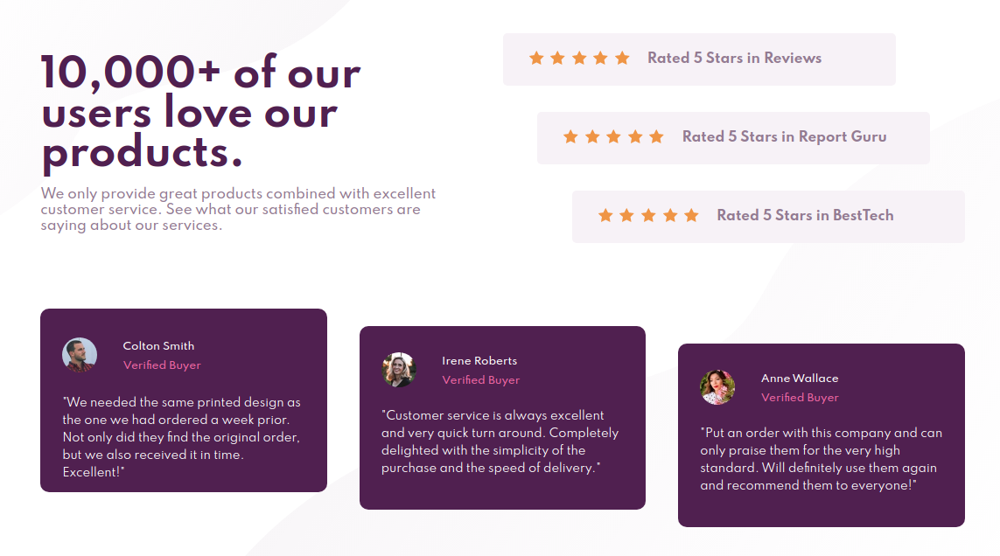

# Frontend Mentor - Social proof section solution

This is a solution to the [Social proof section challenge on Frontend Mentor](https://www.frontendmentor.io/challenges/social-proof-section-6e0qTv_bA). Frontend Mentor challenges help you improve your coding skills by building realistic projects. 

## Table of contents

- [Overview](#overview)
  - [The challenge](#the-challenge)
  - [Screenshot](#screenshot)
  - [Links](#links)
- [My process](#my-process)
  - [Built with](#built-with)
  - [What I learned](#what-i-learned)
- [Author](#author)

**Note: Delete this note and update the table of contents based on what sections you keep.**

## Overview
Develop a solution that closely matches the screenshots supplied.  Project was done based on screenshots alone.  I did not use any kind of design files (figma/sketch).  Solution was completed using CSS & HTML.

### The challenge

Users should be able to:

- View the optimal layout for the section depending on their device's screen size

### Screenshot

### Links

- Solution URL: [Add solution URL here](https://github.com/spotted76/mentor-social-proof)
- Live Site URL: [Add live site URL here](https://spotted76.github.io/social_proof/)

## My process

### Built with

- Semantic HTML5 markup
- CSS custom properties
- Flexbox
- CSS Grid

**Note: These are just examples. Delete this note and replace the list above with your own choices**

### What I learned

Worked more with grid instead of relying on flexbox for all layouts.  Had an easier time setting background images vs. the first project I worked on.

To see how you can add code snippets, see below:

If you want more help with writing markdown, we'd recommend checking out [The Markdown Guide](https://www.markdownguide.org/) to learn more.

## Author

- Frontend Mentor - [@yourusername](https://www.frontendmentor.io/profile/spotted76)
- Twitter - [@yourusername](https://www.twitter.com/spotted)
